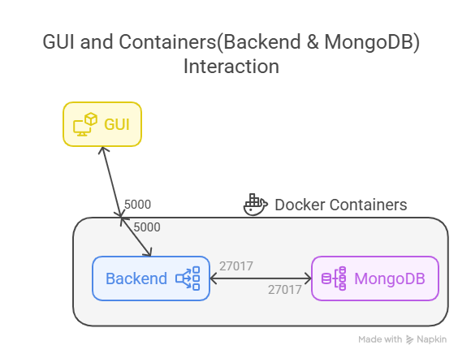
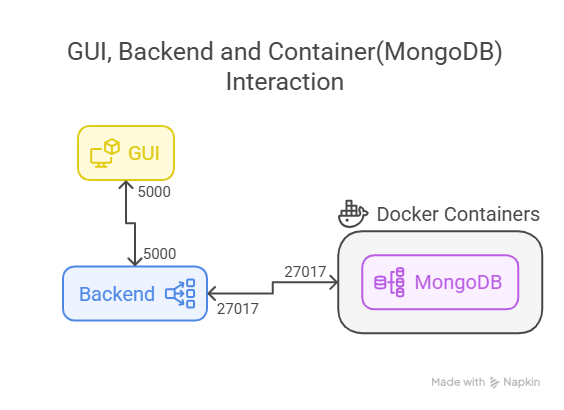
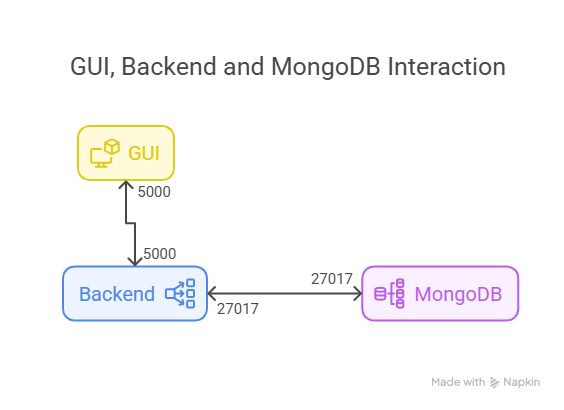

# Ping APP

-   **Tests Status:** [](https://github.com/prashantpateldixoninfo/MyLearning/actions/workflows/run-ping-app-tests-ci.yml)
-   **Code Coverage:** [](https://codecov.io/gh/prashantpateldixoninfo/MyLearning)

## 🚀 Overview

This project demonstrates how to run the `ping` command through a GUI using a Flask backend and MongoDB for data storage.

---

## 📂 Project Structure

```bash
ping-app/
├── gui/                     # Frontend (PyQt5-based GUI)
│   ├── ping_gui.py
│   ├── requirements.txt     # GUI Dependencies
├── backend/                 # Backend (FastAPI)
│   ├── app.py
│   ├── db.py                # MongoDB Connection
│   ├── ping_logic.py        # Ping Logic
│   ├── requirements.txt     # Backend Dependencies
├── tests/                   # Unit Tests
│   ├── test_api.py
│   ├── test_gui.py
├── install_docker_backend_mongodb.bat      # Pre-setup script (Windows) for Backend + MongoDB
├── install_docker_mongodb.bat              # Pre-setup script (Windows) for MongoDB
├── install_all_independent.bat             # Pre-setup script (Windows) for all components independently
├── uninstall_docker_backend_mongodb.bat    # Cleanup script (Windows) for Backend + MongoDB
├── uninstall_docker_mongodb.bat            # Cleanup script (Windows) for MongoDB
├── uninstall_all_independent.bat           # Cleanup script (Windows) for all components independently
├── README.md                               # Documentation
├── .gitignore
```

---

## 🧰 Pre-Installation (Windows)

### 1️⃣ Run Through Backend and MongoDB Containers



#### **Pre-Installation**

To set up the project with Backend and MongoDB running as Docker containers, use the following script:

```bash
./install_docker_backend_mongodb.bat
```

This script performs:

-   Creates a Python virtual environment using `venv`.
-   Installs Backend, GUI, and test dependencies.
-   Starts both MongoDB(`ping-app-mongo`) and Backend(`ping-app-backend`) containers using Docker Compose.

> ⚠️ Ensure Docker Desktop is installed and running.

#### **Running the Application**

After running the `install_docker_backend_mongodb.bat` script:

1. Launch the GUI:

```bash
python gui/ping_gui.py
```

#### **Cleanup**

To stop and remove the MongoDB and Backend containers, use the following script:

```bash
./uninstall_docker_backend_mongodb.bat
```

This script stops and removes both the MongoDB(`ping-app-mongo`) and Backend(`ping-app-backend`) containers.

---

### 2️⃣ Run Through MongoDB Container



#### **Pre-Installation**

To set up the project with only MongoDB running in a Docker container, use the following script:

```bash
./install_docker_mongodb.bat
```

This script performs:

-   Creates a Python virtual environment using `venv`.
-   Installs Backend, GUI, and test dependencies.
-   Starts the MongoDB container (`ping-app-mongo`) using Docker.

> ⚠️ Ensure Docker Desktop is installed and running.

#### **Running the Application**

After running the `install_docker_mongodb.bat` script:

1. Start the Backend:

```bash
python backend/app.py
```

2. Launch the GUI:

```bash
python gui/ping_gui.py
```

#### **Cleanup**

To stop and remove only the MongoDB container, use the following script:

```bash
./uninstall_docker_mongodb.bat
```

This script stops and removes the MongoDB container (`ping-app-mongo`).

---

### 3️⃣ Run Through Without Containers (All Applications Independently)



#### **Pre-Installation**

To set up the project with MongoDB, Backend, and GUI all running independently (without Docker for Backend and MongoDB), use the following script:

```bash
./install_all_independent.bat
```

This script performs:

-   Creates a Python virtual environment using `venv`.
-   Installs Backend, GUI, and test dependencies.
-   Starts MongoDB, Backend, and GUI applications independently.

> ⚠️ Ensure Docker Desktop is installed and running.

#### **Running the Application**

After running the `install_all_independent.bat` script:

1. Start MongoDB:

Follow the installation process for MongoDB using `mongod` or Docker, depending on your configuration.

```bash
mongo --version
net status MongoDB
net start MongoDB
net stop MongoDB
```

2. Start the Backend:

```bash
python backend/app.py
```

3. Launch the GUI:

```bash
python gui/ping_gui.py
```

#### **Cleanup**

To clean up all applications (MongoDB, Backend, GUI) independently, use the following script:

```bash
./uninstall_all_independent.bat
```

This script:

-   Removes the virtual environment and cleans up the project.

---

## 🧪 Running Tests

To run the test cases, use the following command:

### 🪟 Windows (PowerShell or Git Bash)

```powershell
set PYTHONPATH=. && pytest tests
```

This will run both the API and GUI tests.

---
